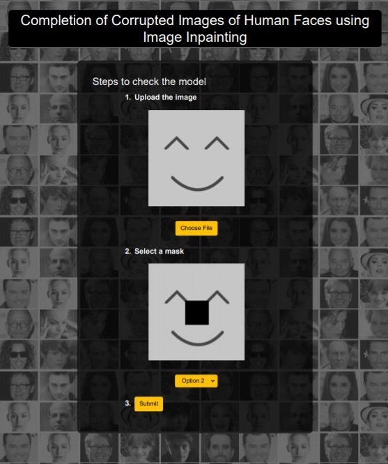
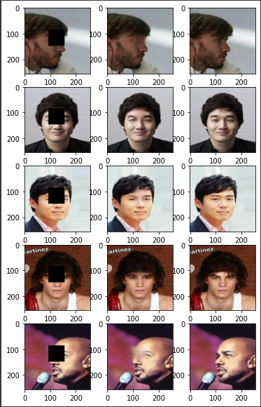
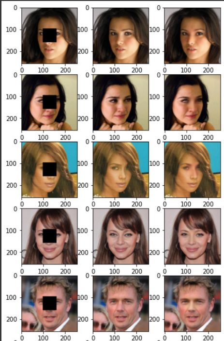

## COMPLETION OF CORRUPTED IMAGES OF HUMAN FACES USING IMAGE INPAINTING

There are lots of mysteries unsolved due to tarnished images with blurs or noise. Thus reconstructing or editing a picture has always been a popular subject. And with the advancement in technology, automatic reconstruction/completion of images using machine learning algorithms have gained popularity. It has become an important and challenging task. Several researchers have been working on this for a long time. There have been several works done in this field generating an impressive state of the art. The designs of the models varied from a simple sequential network to complex deep learning neural networks. The recent models based on the convolutional neural networks and GAN have displayed promising results for the challenging task of regenerating the corrupted images. 

Analysing these approaches and based on our observations, we decided to improvise and develop a new model by combining the learning methods based on GAN and CNN autoencoder-decoder. We used the Unet model as the generator and the CNN models as a discriminator which classifies images into real and fake. Our proposed approach is based on the fundamental thought of two models trying to improve themselves in order to beat each other, where discriminator trains to better the generator and generator trains to better the discriminator. When we tested our model on a human faces dataset (CelebHQ), the results obtained were quite efficient and promising. We also tried to improve results by training the grouped dataset based on gender individually. 

To showcase our project, we made a flask-based web application tool. The tool asks for input images from the user. The input image will be masked using the mask selected by the user. The masked image is processed by the model and the backend(which loads the saved model) processes and gives the outputs.

Create a "Output" folder inside "static" folder before running app.py

The following gif shows the steps:

The following figure shows the result from our model displayed on the web app.

Some other results obtained from our models 

* Autoencoder decoder

 

* Ensemble

  

 

* GAN

* [Pre-Trained Model](https://drive.google.com/drive/folders/1FuTXiJc9DKdBuWZ7MPyUs7vLKjbdclyu?usp=sharing)

>> Note : model were run on google cloud platform 
